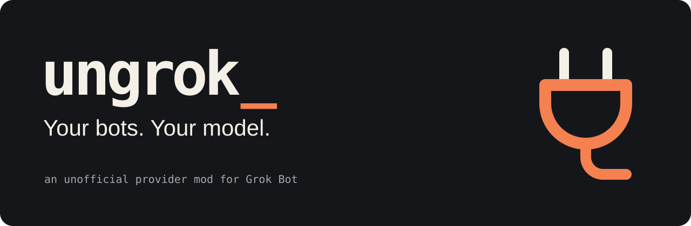

<p align="center"></p>

# ungrok

**Connect your AI subscriptions to Grok Bot.**

Use Claude or ChatGPT inside Grok Bot through the official Claude Code or Codex client. Keep the Grok Bot app and its tools, and sign in with your own subscription. No API keys.

> **Early access:** Fresh-install testing is still pending, and Claude tool-result follow-up remains unverified. [Test results and supported versions](docs/compatibility.md)

## Getting Started

### 1. Check what you need

- **Grok Bot installed and signed in**, with active access through an eligible Cursor plan or linked subscription. [Access requirements](https://cursor.com/help/grok-bot/plans)
- **Your own Claude or ChatGPT subscription.** Claude requires Pro or Max; ChatGPT needs subscription access supported by the pinned Codex client. [Supported clients and sign-in](docs/providers.md)
- **Access to Grok Bot's remote computer**, which you own or are authorized to modify. Setup happens there, not in your Mac's terminal.

**To open the right terminal:**

1. Open the Grok Bot app.
2. Click **Computer** in the **top-right corner**.
3. Once the remote computer opens, open **Terminal inside that computer**.
4. Run the installation commands in that terminal. Leave your Mac's own Terminal app closed for this setup.

The remote computer needs Python 3.10+, Git, Node/npm, and Pillow for large-image resizing. You or your assistant will check these before installing.

### 2. Install ungrok

Choose either option below. Both install the same integration.

#### Option A: Install with your AI

Paste this into your coding assistant:

```text
Help me install ungrok: https://github.com/abhaysudhir/ungrok

Read docs/agent-setup.md and follow the documented release instructions.
Ask whether I want Claude or ChatGPT, then check the prerequisites on
my Grok Bot remote computer. If you cannot access it, guide me one step
at a time. Ask before making changes, have me pause bots and routines,
and let me complete official sign-in myself. Verify the setup in the
app and report anything that remains untested. Never request my tokens
or bypass safety checks.
```

The assistant needs remote Computer terminal access to carry out the installation. Otherwise, it can walk you through it. You'll choose your provider, complete sign-in, and approve changes and restart.

#### Option B: Install it yourself

<details>
<summary>Open the step-by-step terminal instructions</summary>

These commands use the published **v0.2.0-alpha.1** release. In Grok Bot, click **Computer in the top-right corner**, then open **Terminal inside the remote computer**. Run one block at a time there. Stop if a command fails. Do not run these commands in your Mac's terminal or use sudo.

**1. Check the computer.**

```sh
uname -s
python3 --version
git --version
node --version
npm --version
```

Expect Linux, Python 3.10 or newer, and working Git, Node, and npm commands. If a prerequisite is missing, see [setup help](https://github.com/abhaysudhir/ungrok/discussions) before continuing. Leave Grok's existing runtime unchanged.

**2. Download ungrok and check the host.**

```sh
git clone --branch v0.2.0-alpha.1 --depth 1 https://github.com/abhaysudhir/ungrok.git ungrok-0.2.0-alpha.1
```

After the clone succeeds:

```sh
cd ungrok-0.2.0-alpha.1
git rev-parse HEAD
./ungrok doctor
```

Keep this folder and the printed commit for recovery. On a fresh install, doctor may report that provider configuration is missing; that is expected. Stop on an unsupported host, existing foreign patch, or other error. If you already have an installation, follow [migration and recovery](docs/updates.md) instead of overwriting it.

**3. Install the supported clients.**

This installs the pinned Claude Code and Codex clients in a new user-local folder, without global installation or package scripts:

```sh
ungrok_clients="$HOME/.local/share/ungrok/clients-0.2.0-alpha.1"
mkdir -p "$HOME/.local/share/ungrok"
mkdir -m 700 "$ungrok_clients" && npm install --prefix "$ungrok_clients" --ignore-scripts --no-audit --no-fund '@anthropic-ai/claude-code@2.1.263' '@openai/codex@0.153.4'
```

If the folder already exists, stop and inspect it; do not delete it to retry. After installation succeeds, verify:

```sh
"$ungrok_clients/node_modules/.bin/claude" --version
"$ungrok_clients/node_modules/.bin/codex" --version
```

Expect Claude Code **2.1.263** and Codex **0.153.4**. Other versions are unsupported. Keep using this terminal so the `ungrok_clients` variable remains set. Doctor also reports Pillow availability; missing Pillow affects most photos and screenshots. See [large-image support](docs/getting-started.md#large-image-support).

**4. Choose your provider and sign in.**

Run **one** of these blocks to select your provider:

Claude:

```sh
ungrok_provider=claude
ungrok_cli="$ungrok_clients/node_modules/.bin/claude"
```

ChatGPT:

```sh
ungrok_provider=chatgpt
ungrok_cli="$ungrok_clients/node_modules/.bin/codex"
```

Then sign in:

```sh
./ungrok login "$ungrok_provider" --cli "$ungrok_cli"
```

Complete the official sign-in flow yourself. Never post login codes, tokens, or credential files. If you use a custom sign-in profile, check [profile requirements](docs/getting-started.md) before continuing.

**5. Apply the settings and test the connection.**

Finish all bot work and pause routines first. This changes the shared computer for every bot, and an existing installation can use new settings immediately.

```sh
./ungrok setup --provider "$ungrok_provider" --cli "$ungrok_cli"
```

Read and approve the setup prompt. To choose a specific supported model, add `--model MODEL` to that command; otherwise it uses the official client's default.

After setup succeeds:

```sh
./ungrok probe
```

The probe uses subscription allowance. Stop on failure. A passing probe checks the native client, not the app's tools or images.

**6. Restart the verified host.**

Keep bots idle and routines paused. Find the host process:

```sh
pgrep -af 'host-main.cjs'
```

Identify the process for this computer's `sand-host/host-main.cjs`. Replace `HOST_PID` below with its numeric process ID. If there are multiple candidates or you are unsure, ask for [setup help](https://github.com/abhaysudhir/ungrok/discussions); do not guess.

```sh
./ungrok restart --pid HOST_PID
```

The command checks the process and supervisor before asking for restart approval. Do not kill generic Node processes if it refuses. Wait for Grok Bot to reconnect, then continue with **Check your setup** below.

</details>

### 3. Check your setup

After either installation option, send an idle bot this message:

> Reply exactly UNGROK_OK. Do not use tools or message other bots.

Check the fresh host logs for `[ungrok] native session provider=... model=...` matching your selected provider. A reply alone does not prove the integration handled it. If you cannot locate that evidence, ask for [setup help](https://github.com/abhaysudhir/ungrok/discussions) rather than assuming success; never post full logs or credentials.

Next, try a harmless tool task, such as asking for the names in an empty test folder, and attach a small test image with an obvious answer. You can do these checks yourself or ask your assistant to help. Keep important routines paused until the checks pass. See [verification details](docs/getting-started.md#6-verify-in-the-app) if anything fails.

Then use your bots in the same app. The provider and model setting applies to **all bots on that shared computer**.

## Before you use it

- Pause active work and routines **before setup or model/provider changes**. On an existing installation, new sessions can pick up changed settings before restart.
- Conversations, tool results, and images go to your chosen provider. Subscription limits still apply; ungrok does not guarantee unlimited use or zero Grok charges.
- Grok Bot updates can remove the integration. Keep your installation checkout and backup, and follow the [recovery guide](docs/updates.md) if routing changes or you want to undo setup.

## Help and documentation

[Setup questions](https://github.com/abhaysudhir/ungrok/discussions) · [Report a bug](https://github.com/abhaysudhir/ungrok/issues/new/choose) · [Troubleshooting](docs/troubleshooting.md)

For custom paths and configuration, see the [detailed installation guide](docs/getting-started.md).

[How it works](docs/architecture.md) · [Security and privacy](SECURITY.md) · [Compatibility](docs/compatibility.md) · [Updates and rollback](docs/updates.md)

## Contributing

See [CONTRIBUTING.md](CONTRIBUTING.md) for development and tests, and the [release checklist](docs/release-checklist.md) for verification requirements. The unreleased `./ungrok start` wizard is documented in the [development setup guide](docs/easy-setup.md); it is not in the published alpha archive.

## License

[MIT](LICENSE). Earlier work derives from BlockedPath's MIT-licensed adapter. See [provenance](vendor/UPSTREAM.md).

Unofficial. Not affiliated with xAI, Cursor, Anthropic, or OpenAI.
